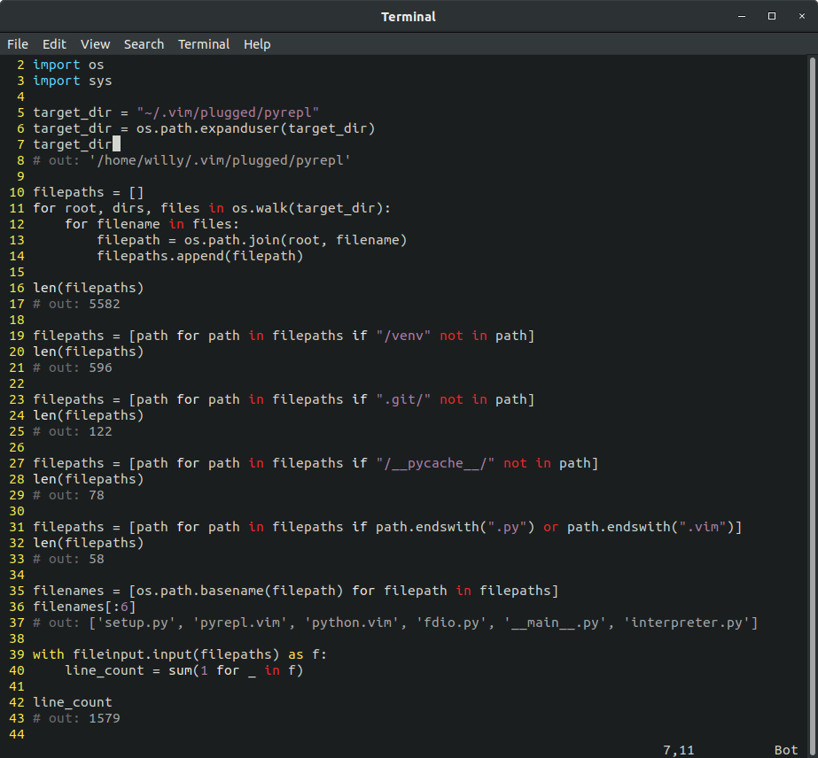
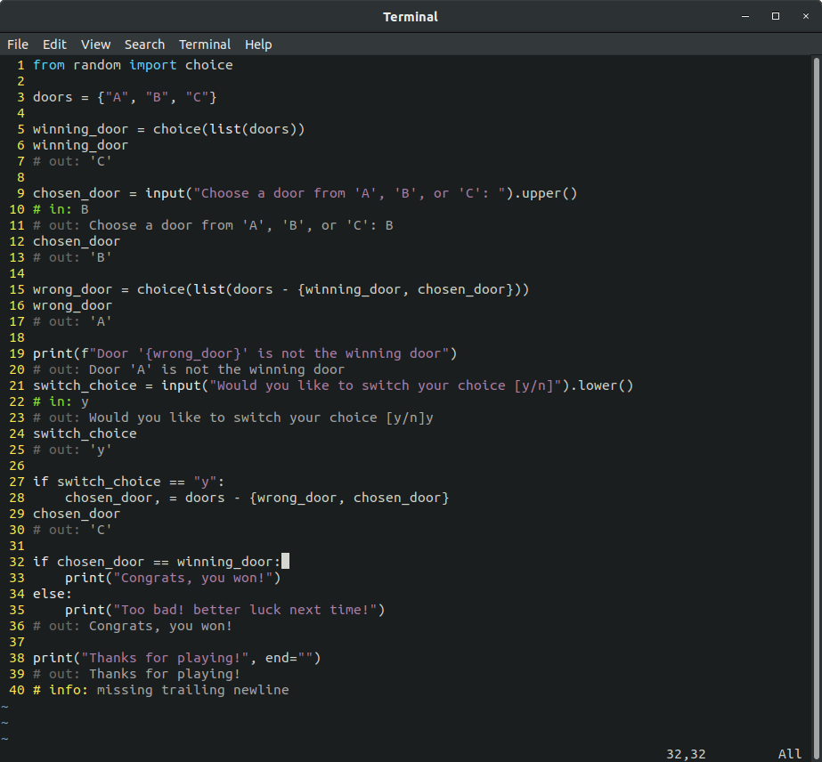

# PyRepl 

[](https://github.com/07734willy/PyRepl/releases/)
[](https://lbesson.mit-license.org/)


A vim plugin for executing python code within the buffer, displaying the results. It serves as a middle-ground between using a full-blown python notebook as with Jupyter or IPython, and merely using the Python REPL. This allows the user to write their code in their normal vim environment, run and see the result inline, and then make any corrections, all without leaving vim. 

Below are a couple of example screenshots, just to give a feel for how it works.

<details>
  <summary>Screenshots</summary>
  
 
</details>

## Requirements

This plugin requires Python 3.7+ to evaluate your python script. It has been tested to work on Python 3.6.9, however tests are not ran automatically against this version, and thus it may break in the future.

Tested on with both Vim 8.0 and NeoVim 0.4.3, however its very likely that this plugin will work on older versions, since it doesn't do anything too crazy vim-side.

For the plugin itself, there are no other language or package dependencies. PyRepl is meant to be lightweight and portable. For development, packages listed in `requirements.txt` are used for testing and linting the plugin itself, but are not required for regular usage. 

## Installation

To install the plugin, you'll likely want to use some plugin manager. Below are examples using Vim-Plug and Vundle, but you're free to use whichever plugin manager you prefer.

#### [**Vim-Plug**](https://github.com/junegunn/vim-plug)

Once you've installed Vim-Plug, drop the following into your vimrc, reopen vim, then `:PlugInstall`.

```vim
call plug#begin('~/.vim/plugged')
Plug '07734willy/PyRepl'
call plug#end()
filetype plugin on
```

#### [**Vundle**](https://github.com/VundleVim/Vundle.vim)

Once you've installed Vundle, drop the following into your vimrc, reopen vim, then `:PluginInstall`.

```vim
set nocompatible
filetype off

" set the runtime path to include Vundle and initialize
set rtp+=~/.vim/bundle/Vundle.vim
call vundle#begin()

" let Vundle manage Vundle, required
Plugin 'VundleVim/Vundle.vim'
Plugin '07734willy/PyRepl'

call vundle#end()
filetype plugin on
```

## Customization

There are a handful of variables you can set to tweak the plugin's behavior.

**Behavioral**

```vim
" Dictates how long (in seconds) to wait before killing the python process
" Note that since vim is single-threaded, it will hang until the python process terminates
let g:pyrepl_timeout = 1

" This can be changed to the path of the specific executable you wish to have run your code
" If you are using virtualenv, you should be fine. This is for others who don't use virtual environments
let g:pyrepl_interpreter = "python"

" (Debugging) Changes the location of the logfile produced when the interpreter crashes or 
" things go "bad" in general. Defaults to `logs/debug.log` in the PyRepl project directory
let g:pyrepl_logfile = "dir/debug.log"

" (Debugging) Enables more verbose logging. By default, PyRepl only logs the Python traceback
" for actual crashes, and very severe issue (omitting any userdata). Enabling this in turn
" enables more detailed logging, which may contain data about the source code it processes
let g:pyrepl_debug = 1
```

**Mappings**

Note that the default mappings use the \<localleader\> key, which is by default, bound to `\` (backslash). You can change this with the command: `let maplocalleader = ...`. You may also choose to remap commands to something else entirely. It is highly recommended that you customize these keybindings.

```vim
" Add this statement if you intend to set the mappings yourself
let g:pyrepl_mapkeys = 0

" By default, buffer evaluation is mapped to <localleader>ee
" Mnemonic: "Evaluate [to] End" or "Evaluate Everything"
nnoremap <buffer> <silent> <localleader>ee :PyReplEval<CR>

" Given a range, PyReplEval will only evaluate code in that region
" By default, evaluation up until (and including) the current line is bound to <localleader>eu
" Mnemonic: "Evaluate Until [line]"
nnoremap <buffer> <silent> <localleader>eu :0,PyReplEval<CR>

" By default, clearing output is mapped to <localleader>c
" Mnemonic: "Clear"
nnoremap <buffer> <silent> <localleader>c :PyReplStrip output<CR>

" Valid arguments to PyReplStrip are `all`, `output`, `input`, `error` (default: `output`)
```

**Aesthetics**
  
Below are the default colors of the highlight groups, feel free to override them

```vim
highlight PyReplComment ctermfg=grey
highlight PyReplIn      ctermfg=green
highlight PyReplOut     ctermfg=darkgrey
highlight PyReplInfo    ctermfg=yellow
highlight PyReplError   ctermfg=darkyellow
```

## Links

Github: https://github.com/07734willy/PyRepl
  
Vim.org: 
